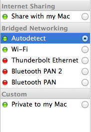

# Virtual Machine Setup

## 

1. Be sure you have an up-to-date installation of your VMware virtualization software.

2. From the VMWare __File__ menu, select __Open__ and navigate to the .vmx file included in your Learning VM download. You can also drag and drop the .vmx file into the VMWare virtual machine library.

3. Don't launch the VM just yet; we'll want to adjust a couple of settings first. With the Learning VM selected in the VMWare library, open the __Settings__ panel and click the __Network Adapter__ icon.

4. Select __Autodetect__ under the __Bridged Networking__ heading as shown in the example.

	

5. Next, we'll want to allocate some extra memory to the Virtual Machine to ensure that it has the resources neccessary for everything to run smoothly. Go back to __Settings__ panel and click the __Processors & Memory__ icon. We suggest allocating at least two gigabytes of memory. Use the slider to set your memory allocation. Note that the Learning VM will likely still function with less memory allocated, but you may encounter performance issues.

	

6. Now that your settings are configured, click the __Power On__ button to boot up the VM.

	NOTE: Virtualization software uses mouse and keyboard capture to 'own' these devices communicate input to the guest operating system. The keystroke to release the mouse and keyboard will be displayed at the top right of the VM window.

7. Once the VM is booted up, make a note of the IP address. You'll need this to access your Quest Guide and the Puppet Enterprise Console. If you forget the IP or if it changes, you can access it again by entering the following command in the VM commandline.

		ifconfig

<!-- Not needed

8. Now that the VM is running you're ready to launch your Quest Guide. First, Navigate into the quest_guide directory in your virtual machine:

		cd ~/quest_guide
	
9. We built the Quest Guide with a static site generator called Jekyll. To launch the Quest Guide, enter the following command:

		jekyll serve --detach
	
10. To view the Quest Guide, open a web browser on your host system and enter the url, inserting the VM IP you noted earlier:

		<vm's IP>:4000

-->