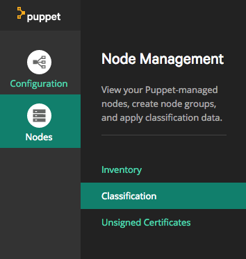
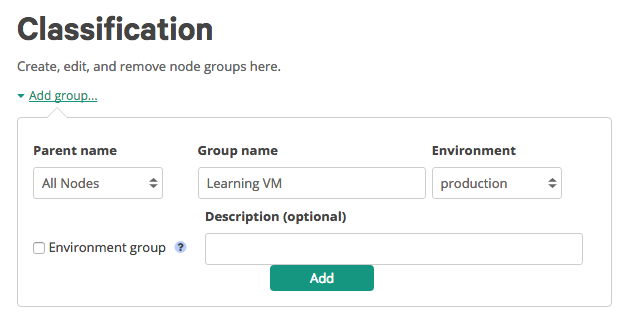

# The Power of Puppet

## Quest objectives

- Use a Puppet module to set up a Graphite monitoring server on the Learning VM.
- Use the Puppet Enterprise console's node classifier to efficiently manage the
  Learning VM's configuration.

## Get started

We covered introductions in the last quest. Now it's time to dive in and see
what Puppet can actually do.

In this quest you will use the Puppet Enterprise (PE) console to set up Graphite,
an open-source graphing tool that lets you easily visualize the state of your
infrastructure. Graphite, like Puppet, spans the gap between nuts-and-bolts and
the big-picture, which makes it a good example to get you started on your path
to Puppet mastery.

One more note: as you go through this quest, remember that Puppet is a powerful
and complex tool. We will explain concepts as needed to complete and understand
each task in this quest, but sometimes we'll hold off on a fuller explanation until
a later quest. Don't worry if you don't feel like you're getting the whole story
right away; keep at it and we'll get there when the time is right!

Ready to get started? Type the following command:

    quest --start power_of_puppet 

## Forge ahead

Graphite is built from several components, including the Graphite Django webapp frontend,
a storage application called Carbon, and Whisper, a lightweight database system. Each of
these components has its own set of dependencies and requires its own installation, and
configuration. You could probably get it up and running yourself if you set aside a little
time to read through the documentation, but wouldn't it be nice if somebody had already
done the work for you?

You're in luck! Puppet Labs operates a service called the [Puppet Forge](http://forge.puppetlabs.com),
which serves as a repository for Puppet *modules*. A module nicely packages all the
code and data Puppet needs to manage a given aspect in your infrastructure, which
is especially helpful when you're dealing with a complex application like Graphite.

Task 1:

The `puppet module` tool lets you search for modules directly from the command line.
See what you can find for Graphite. (If you're offline and run into an error, look for
instructions below on installing a locally cached copy of the module.)

    puppet module search graphite

Cool, it looks like there are several matches for Graphite. For this quest, use 
Daniel Werdermann's module: `dwerder-graphite`.

Among the available modules, the Forge includes two categories of reviewed modules.
**Puppet Approved** modules adhere to a set of Puppet Labs specifications for style, documentation, and
semantic versioning, along with other best practices standards. **Puppet Supported** modules are
rigorously tested for compatibility with Puppet Enterprise and are fully supported by Puppet Labs.

Task 2:

Now that you know what module you want, you'll need to install it to the Puppet
master to make it available for your infrastructure. The `puppet module` tool makes
this installation easy. Go ahead and run:

    puppet module install dwerder-graphite
    
If you don't have internet access, run the following terminal commands to use
cached versions of all the modules required for quests in this guide:

    for m in /usr/src/forge/*; do puppet module install $m --ignore-dependencies; done

This installs the modules for all of the quests in this guide. You can
skip future instructions for installing modules.)

Easy enough, but what did we do, exactly?

When you ran the `puppet module` command, Puppet retrieved the `graphite` module from
Forge and placed it in the Puppet master's *modulepath*. The modulepath is where
Puppet will look to find Puppet classes and other files and resources made available by any
modules you download or create. For Puppet Enterprise, the default modulepath is
`/etc/puppetlabs/code/environments/production/modules`.

## Class and classification

The `graphite` *module* includes Puppet code that defines a `graphite` *class*.
In Puppet, a *class* is simply a named block of Puppet code that defines a set
of associated system resources. A class might install a package, customize an
associated configuration file for that package, and start a service provided by
that package. These are related and interdependent processes, so it makes sense
to organize them into a single configurable unit: a class.

While a module can include many classes, it will generally have a main class that
shares the name of the module. This main class will often handle the basic installation
and configuration of the primary component the module is designed to manage.

The `graphite` class contains the instructions Puppet needs to set up Graphite,
but you still need to tell Puppet where and how you want it to apply the class
across your infrastructure. This process of matching classes to nodes is
called *classification*.

### Access the PE console

We're going to explore some alternative ways to classify nodes in future quests, but for
the moment we'll opt for the simplicity of the the PE console's built-in node classifier.
Now that you have the module installed, let's go through the steps of creating
a node group, adding the Learning VM to the group, and classifying the group with the
`graphite` class.

But before you can access the PE console you'll need the Learning VM's IP address.

Task 3:

Of course, you could use a command like `ifconfig` to find this, but let's do it the Puppet
way. Puppet uses a tool called `facter` to collect facts about a system and make them
available at catalog compilation. This is how it knows, for example, whether it's on
Ubuntu and needs to use `apt-get` or CentOS and needs `yum`. You'll learn more about
facts and conditionals in Puppet later. For now, we can use `facter` in the command-line
to determine the Learning VM's IP address.

    facter ipaddress

Open a web browser on your host machine and go to `https://<IPADDRESS>`, where
`<IPADDRESS>` is the Learning VM's IP address. (Be sure to include the `s` in
`https`!)

The PE console certificate is self-signed, so your browser may give you a security notice.
Go ahead and bypass this notice to continue to the console.

When prompted, use the following credentials to log in:

  * username: **admin** 
  
  * password: **puppetlabs**

### Create a node group

Now that you have access to the PE console, we'll walk you through the steps
to classify the "learning.puppetlabs.vm" node (i.e. the Learning VM)
with the `graphite` class.

First, create a **Learning VM** node group. Node groups allow you to 
segment all the nodes in your infrastructure into separately configurable groups
based on the node's certname and all information collected by the `facter` tool.

Click on *Classification* in the console navigation bar. It may take a moment to load.

From here, enter "Learning VM" as a new node group name and click *Add group* to create
your new node group.

Click on the new group to set the rules for this group. You only want the `learning.puppetlabs.vm` in
this group, so instead of adding a rule, use the *Pin node* option to add the node individually.

Click on the *Node name* field, and you should see the Learning VM's certname autofilled. If no matching
certname appears, trigger a Puppet run (`puppet agent -t`) on the Learning VM. As part of the Puppet
run, the Learning VM will check in, making its information available to the console node classifier.

Click *Pin node*, then click the *Commit 1 change* button in the bottom right of the console
interface to commit your change.

### Add a class

When you installed the `dwerder-graphite` module from the forge, it made the `graphite`
class available in the console.

Under the *Classes* tab in the interface for the Learning VM node group, find the *Class name*
text box. If `graphite` is not yet available, click the *Refresh* button near the top right
of the classes interface and wait a moment before trying again. (If the class still does not
appear, check the [troubleshooting guide](https://github.com/puppetlabs/courseware-lvm/blob/master/SETUP.md#troubleshooting) for more information.)

Once you have entered `graphite` in the *Class name* text box, click the *Add class* button.

Before you apply the class, there are a few parameters you'll want to set.

We already have an Apache server configured to our liking on the Learning VM, so we can
tell the `graphite` class it doesn't need to bother setting up its own server.

There are also some compatibility issues with the latest Django version. The author of this
`graphite` module has made it easy to get around this problem by picking our
own compatible Django version to use. (Keep this in mind when you start writing your own modules!)

Set the parameters, as follows:

1. `gr_web_server      = none`
1. `gr_django_pkg      = django`
1. `gr_django_provider = pip`
1. `gr_django_ver      = "1.5"`

Note that the `gr_django_ver` parameter takes a string, not float value, so it must
be wrapped in quotes for Puppet to parse it correctly.

Double check that you have clicked the *Add parameter* button for all of your parameters,
then click the *Commit 5 changes* button in the bottom right of the console window
to commit your changes.

### Run Puppet

Now that you have classified the `learning.puppetlabs.vm` node with the
`graphite` class, Puppet knows how the system should be configured, but it won't
make any changes until a Puppet run occurs. 

By default, the Puppet agent daemon runs in the background on all nodes you manage with
Puppet. Every 30 minutes, the Puppet agent daemon requests a *catalog* from the
Puppet master. The Puppet master parses all the classes applied to that node,
builds the catalog to describe how the node is supposed to be configured, and
returns this catalog to the node's Puppet agent. The agent then applies any changes
necessary to bring the node into the line with the state described by the
catalog.

Task 4:

To avoid surprises, however, we've disabled these scheduled runs on the Learning VM.
Instead, we'll be using the `puppet agent` tool to trigger runs manually.

As you're working through this Quest Guide, keep in mind that the Learning VM is running *both*
a Puppet master *and* a Puppet agent. This is a bit different than what you'd see in
a typical architecture, where a single Puppet master would serve a collection of
Puppet agent nodes. The Puppet master is where you keep all your Puppet code. Earlier
when you used the `puppet module` tool to install the `graphite` module, that was a
task for the Puppet master. When you want to manually trigger a Puppet run with the
`puppet agent` tool, that's a command you would use on an agent node, not the master.

So put on your agent hat and trigger a Puppet run:

    puppet agent --test

Graphite is a complex piece of software with many dependencies, so this may take a while
to run. After a brief delay, you will see text scroll by in your terminal indicating
that Puppet has made all the specified changes to the Learning VM.

You can also check out the Graphite console running on port 90. (`http://<IPADDRESS>:90`)

We've selected a few parameters as an example. Paste the following path after the
Graphite console URL to try it out:

    /render/?width=586&height=308&_salt=1430506380.148&from=-30minutes&fontItalic=false&fontName=Courier&target=alias(carbon.agents.learning_puppetlabs_vm-a.cpuUsage%2C"CPU")&target=alias(secondYAxis(carbon.agents.learning_puppetlabs_vm-a.memUsage)%2C"Memory")&majorGridLineColor=C0C0C0&minorGridLineColor=C0C0C0

Note that Graphite has only been running for a few minutes, so it may not yet
have much data to chart. If you wait a minute and refresh the page in your
browser, you will see the graph update with new data.

## Review

Great job on completing the quest! You should now have a good idea of how to
download existing modules from the Forge and use the PE console node classifier
to apply them to a node. You also learned how to use the the `facter` command
to retrieve system information, and the `puppet agent --test` command to manually
trigger a Puppet run.
